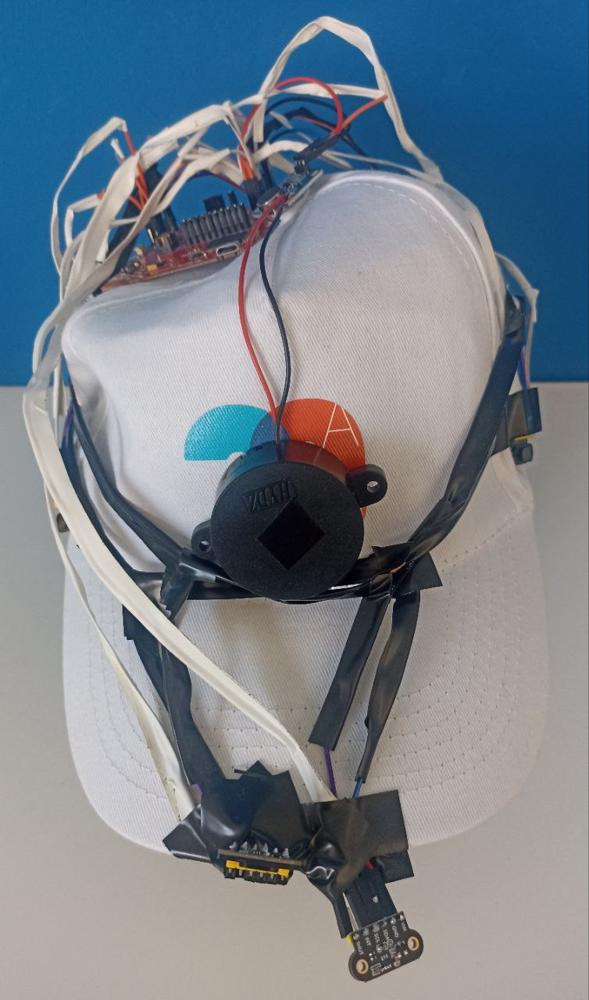
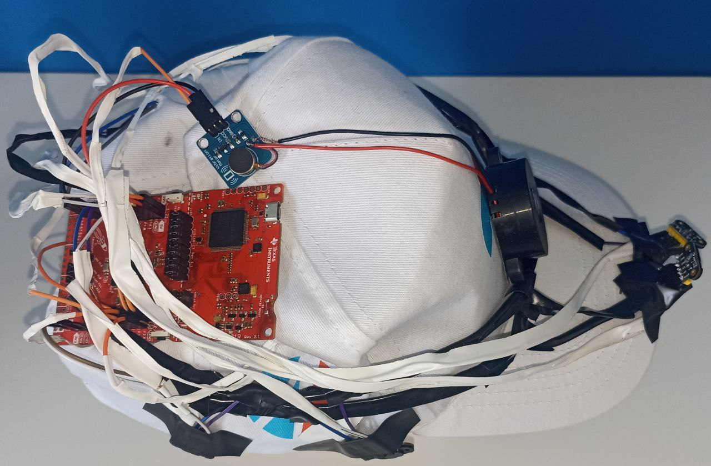
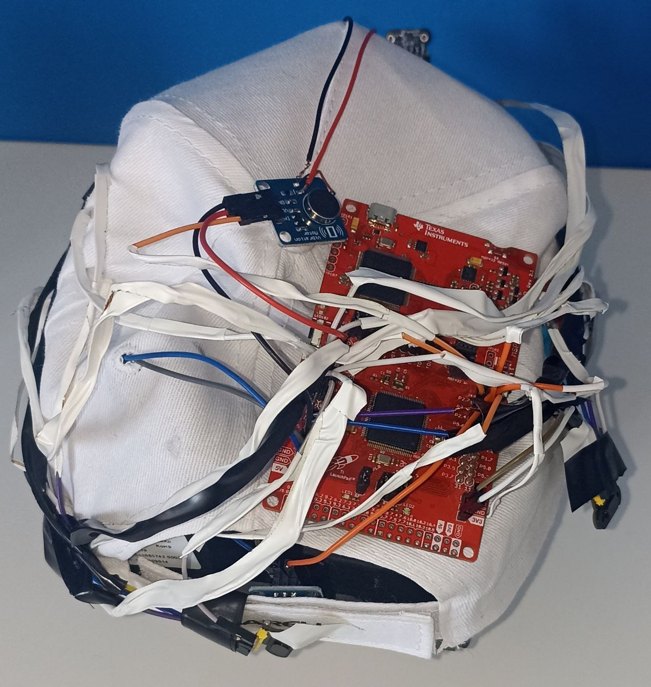

# "Spider-Sense" Device Analysis

This project leverages an embedded system device based on the MSP432P401R Launchpad microcontroller board. The device seamlessly integrates 7 VL53L0X Time-of-Flight (ToF) sensors, connected via I2C, along with 6 5V vibration motors, and 1 piezobuzzer. Designed to be mounted on a cap, the device's architecture includes the board atop, the piezobuzzer positioned at the front, and vibration motors evenly distributed along the cap's inner circumference. Furthermore, 6 lidars are strategically placed over the vibration buttons, while one lidar faces downwards at the front of the hat.

<p align="center">
   
   
   
</p>

## Functionality
The device operates with the following functionalities:
1. Initialization involves setting up the lidar addresses.
2. Upon pressing the P1.1 button, the device commences height measurement and utilizes a probability algorithm to establish the default height.
3. Continuous polling of all sensors ensues, activating respective vibration motors according to measured distances. Stronger vibrations indicate closer objects, lighter vibrations for distant ones, with no vibration beyond 2 meters.
4. The downward-facing lidar triggers the piezobuzzer to emit various signals:
   - Fast beeping for heights exceeding the default (indicating a hole).
   - Continuous sound for unavoidable obstacles (height > default height + 40cm).
   - Normal beeping for detected steps.

## Requirements
### Hardware:
- [MSP432P401R Launchpad](https://www.ti.com/tool/MSP-EXP430FR5994)
- 7x [VL53L0X ToF sensors](https://it.aliexpress.com/item/1005002977961401.html?aff_platform=true&aff_short_key=UneMJZVf&isdl=y&src=bing&pdp_npi=3%40dis%21EUR%212.83%212.30%21%21%211.20%21%21%40%2112000023039141307%21ppc%21%21&albch=shopping&acnt=135095331&isdl=y&albcp=554517167&albag=1309519445239021&slnk=&trgt=pla-4585444532009022&plac=&crea=81845017493928&netw=o&device=c&mtctp=e&utm_source=Bing&utm_medium=shopping&utm_campaign=PA_Bing_IT_PC_customlabel1-20230705&utm_content=customlable1%3D7&utm_term=VL53L0X%20200C%20ToF%20sensors&msclkid=d75801e7b007191e7c956431a3822d9a)
- 6x [5V vibration motors](https://it.aliexpress.com/item/1005005302873260.html?srcSns=sns_Telegram&spreadType=socialShare&bizType=ProductDetail&social_params=60508653939&aff_fcid=ab52eddc0b544a099dea4a1025276cf8-1708528789217-04264-_Evotpdf&tt=MG&aff_fsk=_Evotpdf&aff_platform=default&sk=_Evotpdf&aff_trace_key=ab52eddc0b544a099dea4a1025276cf8-1708528789217-04264-_Evotpdf&shareId=60508653939&businessType=ProductDetail&platform=AE&terminal_id=7b39ca732c4d42a099da9f4804047853&afSmartRedirect=y)
- 1x [Piezobuzzer](https://it.aliexpress.com/item/1005004617365080.html?spm=a2g0o.productlist.main.5.7bfe7605746tWf&algo_pvid=fe297b93-7460-4b17-8e76-85f807f6617c&aem_p4p_detail=202402210720492674003603170060001493032&algo_exp_id=fe297b93-7460-4b17-8e76-85f807f6617c-2&pdp_npi=4%40dis%21EUR%210.54%210.48%21%21%210.57%210.51%21%40211b813c17085288493717219e3cfa%2112000029847955671%21sea%21IT%214607803653%21&curPageLogUid=Bw13ykn6abOA&utparam-url=scene%3Asearch%7Cquery_from%3A&search_p4p_id=202402210720492674003603170060001493032_3)
- Cables

### Software:
- [Energia IDE](https://energia.nu/download/)
- [MSP432P4xx Drivers](https://software-dl.ti.com/msp430/msp430_public_sw/mcu/msp430/MSP-EXP432P401R/latest/index_FDS.html)
- [VL53L0X library](https://github.com/pololu/vl53l0x-arduino/blob/master/VL53L0X.h)

## Project Layout
The project's source code is meticulously organized into logical components and modules, ensuring maintainability and clarity.

### Source Code Organization:
- `project/`: Contains the source code files.
- `test/`: Houses test files.
- `images/`: Hosts images utilized in the Readme.md file.

```

├── project
│   ├── project.ino               # Main code
│   ├── spider_sense.cpp          # Hardware independent library implementation code
│   ├── spider_sense.h            # Hardware independent library header file
│   ├── spider_sense_HD.cpp       # Hardware dependent library implementation code
│   └── spider_sense_HD.h         # Hardware dependent library header file
└── test
|   ├── lidar_test                # Hardare dependent code to test the lidars
|   |   └── lidar_test.ino        # Test code
|   ├── vib_button_test           # Hardare dependent code to test the vibration buttons and the piezobuzzer
|   │   ├── spider_sense.cpp      # Hardware independent library implementation code
|   │   ├── spider_sense.h        # Hardware independent library header file
|   │   ├── spider_sense_HD.cpp   # Hardware dependent library implementation code
|   │   └── spider_sense_HD.h     # Hardware dependent library header file
|   |   └── vib_button_test.ino   # Test code
|   └── library_test.cpp          # Hardware independent library test code
└── images                        # Holds the images needed for the Readme.md file
├── .gitignore
├── LICENSE
├── README.md

```

## Build and Deployment
1. Install [Energia IDE](https://energia.nu/download/) and [MSP432PXX Drivers](https://software-dl.ti.com/msp430/msp430_public_sw/mcu/msp430/MSP-EXP432P401R/latest/index_FDS.html).
2. Install the [VL53L0X library](https://github.com/pololu/vl53l0x-arduino/blob/master/VL53L0X.h).
3. Clone this repository.
4. Open the project/project.ino file in Energia IDE.
5. Build the project.
6. Upload the compiled code onto the MSP432P401R Launchpad.
7. Enjoy your newly acquired superpowers!

## User Guide
1) Assemble and wear the Spider Sense cap.
2) Connect the two boards to a power source and wait a few seconds for the device to boot.
3) Make sure to not have any obstacle in front of the lider which is pointing donwards, click the left button and stay still, Spider Sense will take about ten seconds to calculate your height.
4) After ten seconds, you can start to move around freely.
5) Focus on the feedback you get from the vibration motor when you get close to a wall or a big obstacle, you should be able to distinguish 4 levels of vibration:
     - Critical: the obstacle is closer than 50cm;
     - Strong:   the obstacle is between 50cm  and 100cm;
     - Normal:   the obstacle is between 100cm and 150cm;
     - Light:    the obstacle is betwwen 150cm and 200cm;
6) Now try approaching holes, steps and tables to understand the different signals emitted by the beeper.
7) Now that you're all set up you can use the system to be able to move around freely in low visibility (or no visibility) contitions without getting hurt.
Quick tip: moving your head allows you to detect the presence of low obstacles and holes all around you!

PS: The system needs some time to sense the enviroment, thus you should not move to fast.

## Links
[](https://www.canva.com/design/DAF9aIgwgVA/w0DnBaI3MHDXlyY1cSgh3A/edit?utm_content=DAF9aIgwgVA&utm_campaign=designshare&utm_medium=link2&utm_source=sharebutton)

[](https://youtu.be/8-n8-ijeDpo?feature=shared)


## Team Members
The development of the device was done almost entirely in group sessions where all members were present.
Everyone worked on all aspects of the project together: research, software implementation, wiring and testing.
Although the work was distributed evenly, we can define some areas in which each component had a more significant contribution:
- Adami Filippo: Main focus on the main file and welding and wiring
- Barborini Mattia: Main focus on the hardware independent library
- Grisenti Matteo : Main focus on the hardware dependent library 


